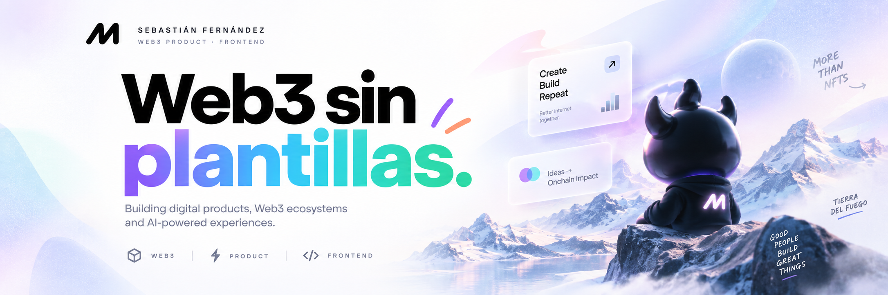

  

📍 Tierra del Fuego, Argentina  
🔥 Founder @ FuegoLabz

---

### Selected work

### 🐂 Bulls & Apes Project
Web3 ecosystem · NFT products · Community experiences

### 🚗 RentAI
AI-powered assistant for vehicle rental businesses.

### 🛒 Provincia Market
Marketplace and e-commerce platform for Tierra del Fuego.

### 📋 Tablerito
Collaborative Kanban workspace.

### 💻 Muvia Multimedia
Landing Page / Multimedia

---

<h2>Stack</h2>

  

---

<h3>What I build</h3>

  
  
  
  

---

<h3>Let's connect</h3>

  
  &nbsp;&nbsp;

  
  &nbsp;&nbsp;

  
  &nbsp;&nbsp;

  

